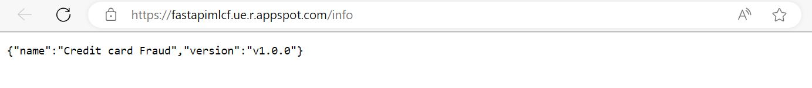

# Backend del proyecto de fraudes en tarjetas de credito 💰
Este es la carpeta que tiene el proceso de despligue del Backend de la aplicacion 
esta se monto sobre GCP en App Engine mediante los siguientes pasos:

Previo a estos pasos se debe tener la carpeta de la aplicacion aislada con su propio ambiente, para esto vamos a generar un archivo llamado **requirements.txt** donde almacenaremos los paquetes necesarios para la aplicacion. Adicionalmente necesitaremos un archivo con el runtime para el inicio de esta. 

Este archivo sera nombrado como **app** y tendra una estructura como la siguiente:
```
runtime: python39
entrypoint: uvicorn main:app --host 0.0.0.0 --port 8080
```
Posteriormente a tener todos los archivos y dependencias necesaerias para la aplicacion seguiremos los siguientes pasos:

1. Instalar el SDK de Google Cloud de este [enlance](https://cloud.google.com/sdk/docs/how-to)
2. Correr ```gcloud init``` en la terminal para logearte con tu cuenta
3. Configurar el Nombre del proyecto y carpeta  ```gcloud config set project [project_id]```
4. Finalmente seleccionar la aplicacion que queremos desplegar
```gcloud app deploy```

La direccion de nuestra API es la siguiente 
**https://fastapimlcf.ue.r.appspot.com/info**



Si se quiere probar en un ambiente local basta con clonar la carpeta y correr lo siguiente:
```
uvicorn main:app --reload
```
