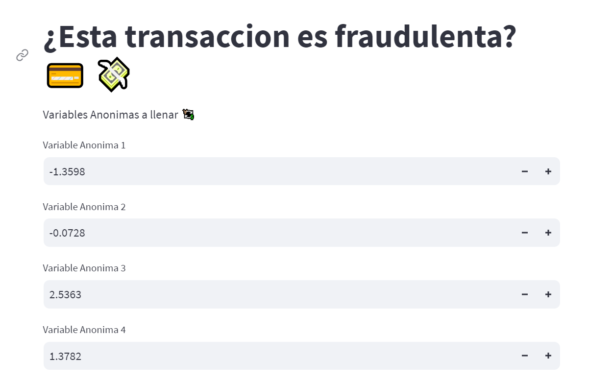
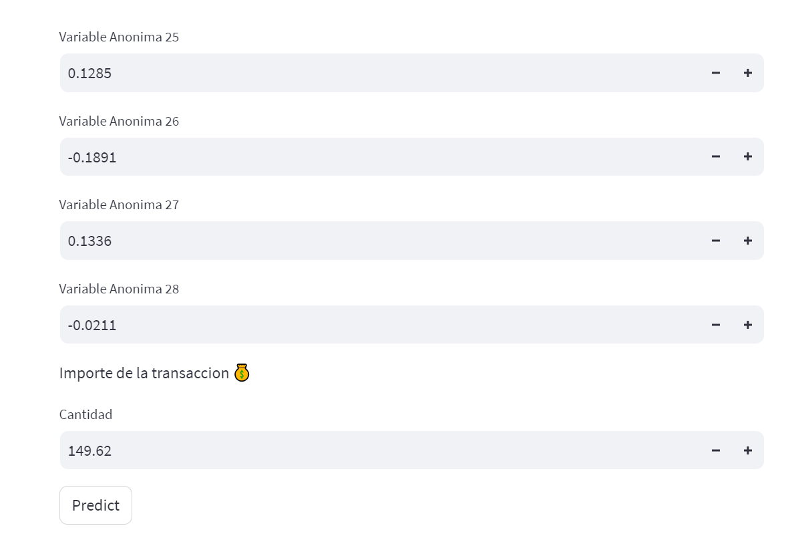
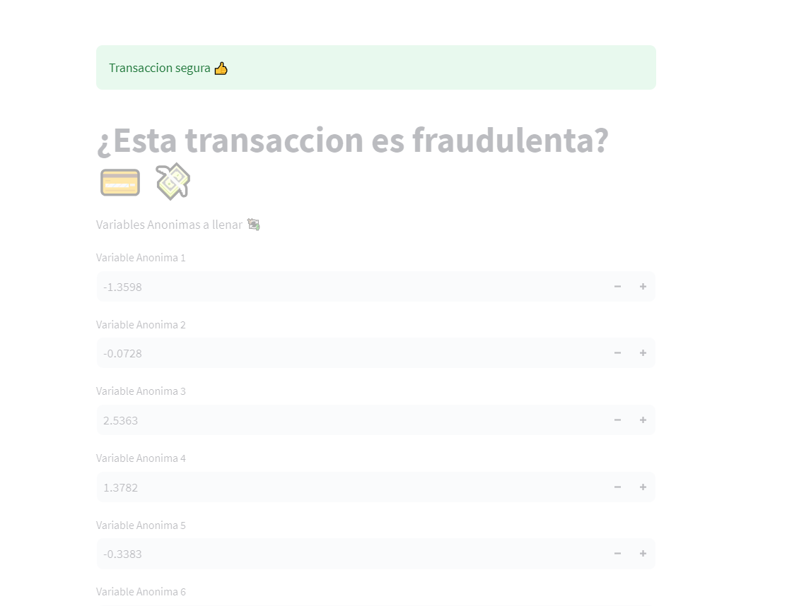
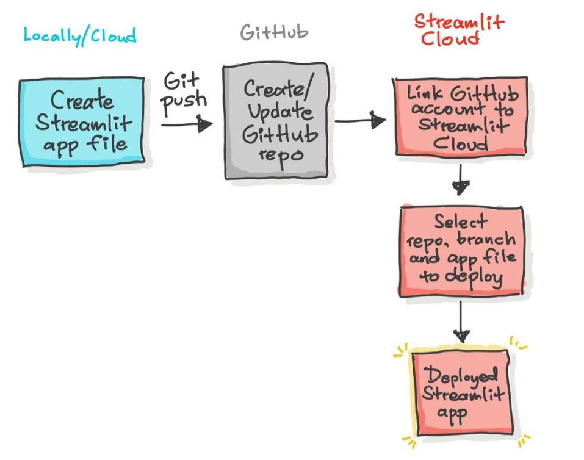

# Fronted del proyecto de fraudes en tarjetas de credito 💰
la interfaz a la cual puedes acceder [aqui](https://fraude.streamlit.app/) , fue creada utilizando Streamlite 📈 esta tiene la siguiente estructura

En esta podemos rellenar los campos requeridos para desoues elegir el boton Predict para poder generar una respuesta, que en este caso sera a la API de nuestro modelo de ML

Finalmente el servidor de la API nos dara una respuesta que podra ser Positiva en caso de ser Fraudulenta o Negativa en caso de ser una transaccion limpia

Esto se desplego con en enlace de la cuenta de Github con Streamlite como se muetra en la siguiente imagen

