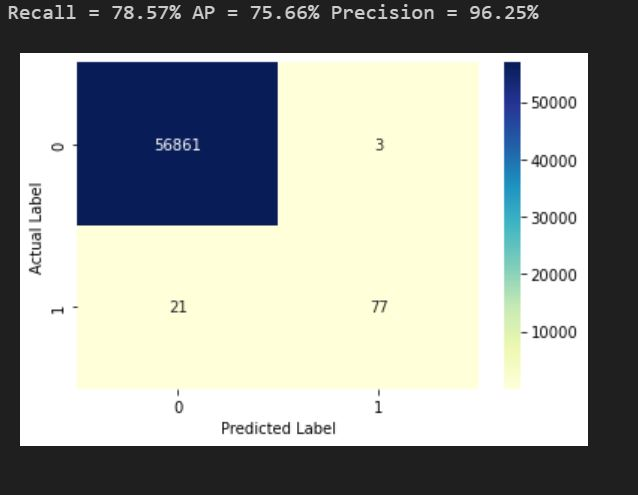

# **Deteccion de Fraude en tarjetas de credito** 💸

## Objetivo 💢
Se utilizara el set de datos de kaggle para poder desarrollar un  modelo  de clasificacion,  y de esta manera montar una aplicacion que nos permita **predecir si una transaccion es Fraudulenta o no**

La descripcion detallada se encuentra en el Jupyter notebook. Sin embargo, debido a su tamaño es dificil de viualizar por lo tanto si quieres ver un vistazo puedes hacerlo en este [enlace](https://nbviewer.org/github/SergioRodMa/Proyecto_CF_ML/blob/main/codigo/Fraude_ML.ipynb)

Para este modelo de clasificacion se busco tener una buena prediccion tanto en la Precision como en el Recall. Es por eso que la metrica que se utilizo para evaluar el desempeño fue la curva PR.

Los resultados de este modelo mostraron un buen comportamiento tanto para precision como para recall, siendo arriba del 70% para ambos.

